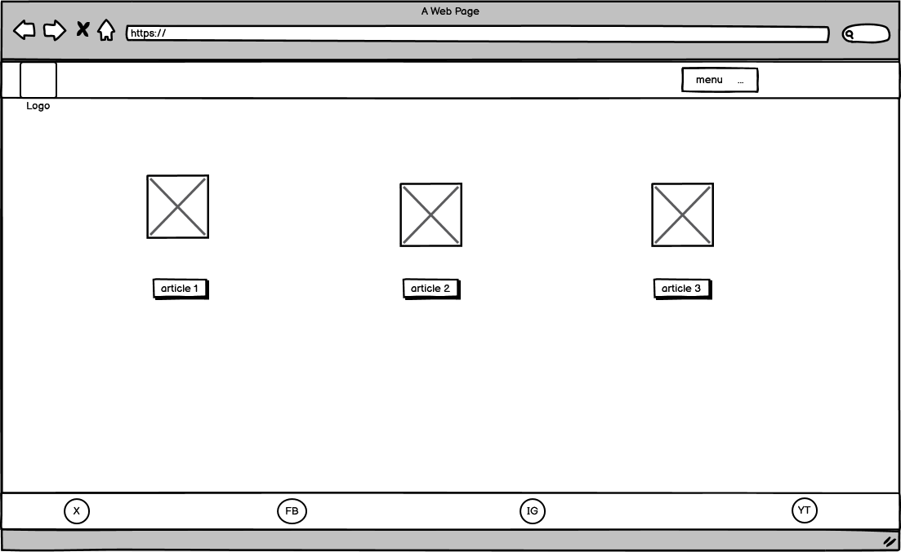

# DIY Blog


Visit the site [here](https://diyblog-2e58e7a03191.herokuapp.com/)


## User Experience (UX)
### User Stories 
As a user I can read DIY articles so that I can learn to fix issues in my home
#### Acceptance Criteria:
- Have DIY articles on the website
- Have articles that can be accesses by all users
#### Tasks:
- Build a blog type website with articles about home DIY content
- Make sure the articles can be accessed by all users not just signed up members

As a site admin I can add and update the about page content so that it is available on the site
#### Acceptance Criteria
- The about app is visible in the admin panel
#### Tasks
- Ensure the about app is available in the admin panel and make sure it has full usability

As a new user,
I want to be able to register for an account,
so that I can access and personalize features that require an authenticated user.

#### Acceptance Criteria
- Access & Form
Clicking "Sign Up" directs me to a registration form with fields for username, email, and password (with confirmation).
- Validation & Error Messages
I see clear error messages for invalid inputs (e.g., duplicate username, password mismatch).
- Successful Registration
Upon valid submission, I receive a success message, am logged in or redirected to login, and my details are saved.

#### Tasks
- Create a sign up uption
- Ensure validation is present with clear error messages
- Success message on succesful registration

As a site user I can view the site so that I can read DIY articles and view the about page

#### Acceptance Criteria
- When the about link is clicked, the about text is visible
- When a blog post is clicked the blog opens fully and is visible to the user
#### Tasks
- Create an about page with sufficient detail about the blog owner
- Create blog posts that are linked to the home page that open fully when clicked to allow the user to read

As a user I can read DIY articles so that I can learn to fix issues in my home

#### Acceptance Criteria
- Have DIY articles on the website
- Have articles that can be accesses by all users
#### Tasks
- Build a blog type website with articles about home DIY content
- Make sure the articles can be accessed by all users not just signed up members

As a logged in user I can comment on posts so that I can communicate with the author and other post readers

#### Acceptance Criteria
- User can create a comment for a post
- delete a comment i created
#### Tasks
- Create functionality to allow logged in users to comment on all posts
- Enable logged in users to delete comments they created

As a logged in user I can modify and delete comments so that I can edit mistakes or delete comments if I no longer want them on the post

#### Acceptance Criteria
- Able to delete comments
- Able to edit comments
#### Tasks
- Create the functionality to allow editing of comments by the same logged in user who created them
- Create functionality to allow editing of comments by logged in users who placed them.

## MoSCoW
This project used the "MoSCoW" method to classify its features and requirements according to their importance towards a minimum viable product (MVP). "MoSCoW" stands for "Must have, Should have, Could have and Won't have," with each classification aiding in the prioritisation of features. This method makes sure that essential components are tackled in priority order.
## Agile Methodologies
### GitHub Projects
Link to the GitHub project page that was used to manage the website build. Items were added to the kanban board and worked through. Items were linked to the project repo and closed off as the project progressed. [github project board](https://github.com/users/fergal92/projects/4)

## Features
### Existing Features

#### Navigation Bar
Users can navigate through the blog sections, such as Home, About, Write blog post, sign up, login, logout.
#### Commenting System 
Signed-in users can leave comments on blog posts.
#### Admin Panel
The admin can manage blog posts and comments, approve or reject user submissions.
#### Blog Post Creation
Signed-up users can submit DIY blog posts after admin approval.
#### About section
Provides information about the site owner and a contact form to allow site users to communicate with the site owner
#### Footer
Provides links to social media channels

### Features left to implement 
- Message box on website
- Search functionality
- Add categories to blog posts
#### Search bar 
To allow searching of blog posts

## Technologies Used
- [Django](https://www.djangoproject.com/) - Django framework was used to build this project
- [Bootstrap](https://getbootstrap.com/) - Bootstrap was used to build the project quickly thanks to the pre configured CSS and JS provided
- [Python](https://www.python.org/) - Python is the language used to write django and is therefore essential to this project
- [javascript](https://www.javascript.com/) - Javascript is an essential language used for web development and is used extensively in this project
- [Bootstrsap](https://getbootstrap.com/) - Bootstrap is used for styling quicly and efficiently in this website
- [PostgreSQL](https://www.postgresql.org/) - This is the relational database used for the project
- [Heroku](https://dashboard.heroku.com) - Heroku is the hosting platform used for the project
- [HTML](https://developer.mozilla.org/en-US/docs/Web/HTML) - was used as the foundation of the site.
- [CSS](https://developer.mozilla.org/en-US/docs/Web/css) - was used to add the styles and layout of the site.
- [CSS Flexbox](https://developer.mozilla.org/en-US/docs/Learn/CSS/CSS_layout/Flexbox) - was used to arrange items simmetrically on the pages.
- [Balsamiq](https://balsamiq.com/) - was used to make wireframes for the website.
- [Git](https://git-scm.com/) - was used for the version control of the website.
- [Am I Responsive](https://ui.dev/amiresponsive) - was used to generate an image of the website across different screen types and resolutions


## Design
### Colours
The color scheme for the website is designed with accessibility in mind. Primary colors include a soft blue for headers and buttons, complemented by neutral grays for text and backgrounds.
### Typography
The font used is Roboto for body text, providing a clean and modern look. Headings use Merriweather for a contrasting, readable style.
### Wireframes
Wireframes were created using Blasamiq. First draft wireframes of the different pages as viewed on a laptop
#### Desktop
Blog post page
Form page
Home page
#### Mobile
Blog post page

Form page

Home page

## Testing
Please refer to the [TESTING.md](TESTING.md) file for all testing documentation

## Deployment

### Local Deployment
In order to make a local copy of this project, you can clone it. In your IDE Terminal, type the following command to clone my repository:

```git clone https://github.com/fergal92/diy-blog.git```

### Deployment to Heroku
The heroku app was deployed at the beginning of the project to ensure any issues were encountered early and could be resolved.

The application has been deployed using Heroku by following these steps:

1. Create the requirements.txt file and run: pip3 freeze > requirements.txt in the console for local deployment. Create env.py file with your own details
2. Commit changes and push them to GitHub.
3. Go to the Heroku's website.
4. From the Heroku dashboard, click on "Create new app". New App
5. Enter the "App name" and "Choose a region" before clicking on "Create app".
6. Go to "Config Vars" under the "Settings" tab.
7. Click on "Reveals Config Vars" and add the KEY: CREDS and the VALUE stored in creds.json file if needed. Config Vars
8. Add the Config Var, KEY: PORT and VALUE: 8000.
9. Go to "Buildpacks" section and click "Add buildpack". Buildpacks
10. Select "python" and click "Save changes"
Add "nodejs" buildpack as well using the same process.
11. Go to "Deployment method", under the "Deploy" tab select "GitHub" and click on "Connect to GitHub".
12. Go to "Connect to GitHub" section and "Search" the repository to be deployed.
Click "Connect" next the repository name.
13. Choose "Manual deploys" to deploy your application. Manual Deployment
14. Apply for student credits and then apply ECO Dynos. EcoDynos
15. Manually deploy the project in Heroku once changes have been made to the repository
The live link to the site can be found here


## Credits

### Content
- The content for this blog was sourced from various DIY websites and personal experiences in home improvement.
- The learning material produced by code institute has been very high quality and I have learned a lot from it. **CODESTAR** The codestar blog app has heavily influnced this project. As it was the only django project I had seen before and with the complexity of producing a django project for the first time I had to heavily lean on the existing codestar project. A lot of the DIY-Blog project is taken from the codestar project but I have made enough changes to it to create a unique standalone project.
### Media
All images used on the blog are either self-created or sourced from free media platforms such as Unsplash and Pexels.

## Future improvements
- Implement search functionality for searching through blog posts
- Add a profile section for user to add preferences and update a personal profile page
- Use best practice naming convention in javascript

## Bugs
All bugs have been resolved

## Acknowledgements
- [Iuliia Konovalova](https://github.com/IuliiaKonovalova) - My mentor Julia was very supportive during this project. She certainly pushed me to complete a high standard of project especially for the readme and testing sections. I took inspiration from her README.md and TESTING.md files for my own.
- [Happiness Generator](https://github.com/broken-helix/happiness/) - My first hackathon project. I learned so much from participating in this project and team. We won the March hackathon for 2024 and my team members were a great source of inspiration for me.
- [freeCodeCamp](https://www.freecodecamp.org/) - I completed the freeCodeCamp responsive web design module before enrolling in code institute and I learned much from that module that I was able to utilise for this project.
- [CodeInstitute](https://learn.codeinstitute.net/) - The learning material produced by code institute has been very high quality and I have learned a lot from it. **CODESTAR** The codestar blog app has heavily influnced this project. As it was the only django project I had seen before and with the complexity of producing a django project for the first time I had to heavily lean on the existing codestar project. A lot of the DIY-Blog project is taken from the codestar project but I have made enough changes to it to create a unique standalone project.
