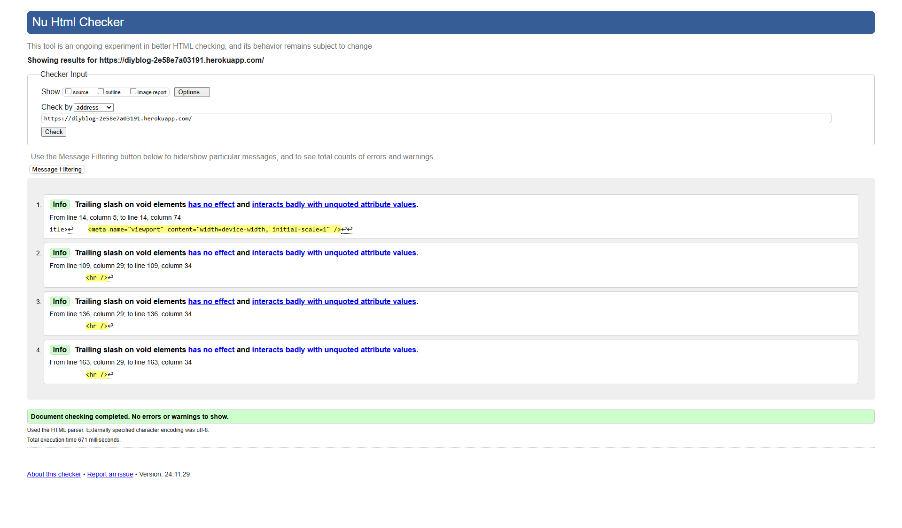
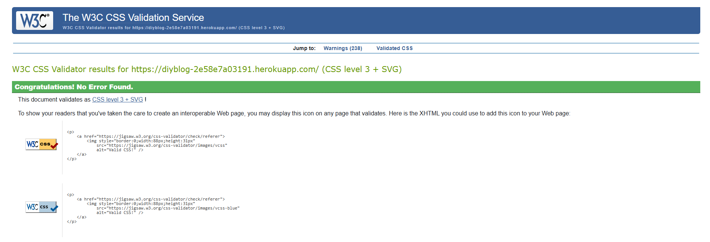
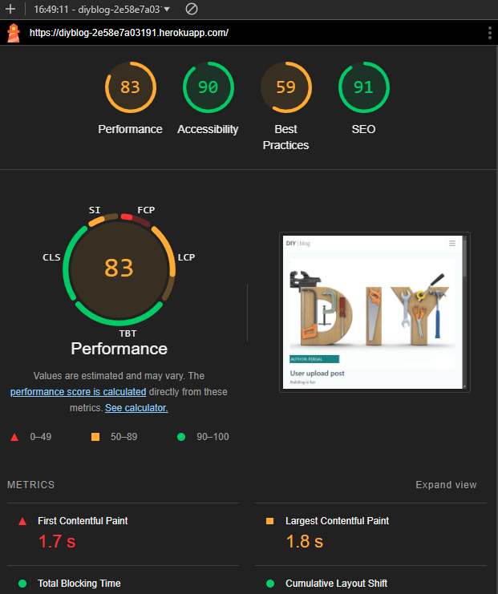

# TESTING

## Manual Testing

Testing was done throughout site development, for each feature before it was merged into the master file.

Usability was tested with the below user acceptance testing, sent to new users to ensure testing from different users, on different devices and browsers to ensure issues were caught and where possible fixed during development.

| **Feature**         | **Test Case**                                                                                       | **Steps to Perform**                                                                                                                                      | **Expected Outcome**                                                                                             | **Status** |
|----------------------|---------------------------------------------------------------------------------------------------|----------------------------------------------------------------------------------------------------------------------------------------------------------|------------------------------------------------------------------------------------------------------------------|------------|
| **User Registration** | Test new user registration.                                                                       | 1. Navigate to the registration page. 2. Fill in valid details (username, email, password). 3. Click "Register".                                   | User account is created, and a confirmation message is displayed.                                                | Passed     |
|                      | Attempt registration with invalid email format.                                                   | 1. Enter invalid email (e.g., `user@.com`). 2. Click "Register".                                                                                      | An error message is displayed indicating the email format is invalid.                                            | Passed     |
|                      | Attempt registration with an already registered email.                                            | 1. Enter an existing email address. 2. Click "Register".                                                                                              | An error message is displayed indicating the email is already in use.                                            | Passed     |
|                      | Test password strength validation.                                                                | 1. Enter a weak password (e.g., `123`). 2. Submit the form.                                                                                           | An error message is displayed prompting the user to use a stronger password.                                     | Passed     |
| **Login**            | Test login with valid credentials.                                                                | 1. Navigate to the login page. 2. Enter registered username/email and password. 3. Click "Login".                                                  | User is redirected to the dashboard/homepage.                                                                    | Passed     |
|                      | Test login with incorrect credentials.                                                            | 1. Enter wrong password for a valid user. 2. Click "Login".                                                                                           | An error message is displayed indicating incorrect login details.                                                | Passed     |
|                      | Check login persistence after refreshing the page.                                                | 1. Log in successfully. 2. Refresh the page. 3. Verify user remains logged in.                                                                     | User remains logged in, and session persists.                                                                    | Passed     |
|                      | Attempt login when the account is locked (if implemented).                                        | 1. Lock a test account (simulate multiple failed login attempts). 2. Attempt to log in.                                                               | An error message is displayed informing the user their account is locked.                                        | Passed     |
| **Post Management**  | Create a new blog post.                                                                           | 1. Log in. 2. Navigate to "Create Post". 3. Fill in title and content. 4. Click "Submit".                                                       | Post is created and displayed on the homepage.                                                                   | Passed     |
|                      | Edit an existing blog post.                                                                       | 1. Navigate to a created post. 2. Click "Edit". 3. Update the title/content. 4. Save changes.                                                   | Changes are saved and reflected on the post.                                                                     | Passed     |
|                      | Delete a blog post.                                                                               | 1. Navigate to a created post. 2. Click "Delete".                                                                                                     | Post is removed from the homepage and database.                                                                  | Passed     |
|                      | Verify draft saving functionality (if applicable).                                                | 1. Create a new post. 2. Save it as a draft. 3. Confirm it does not appear on the homepage but is accessible in the drafts section.                 | Draft is saved and accessible under the drafts section.                                                          | Passed     |
|                      | Test publishing a draft post.                                                                     | 1. Navigate to the drafts section. 2. Select a draft post. 3. Publish it. 4. Confirm it appears on the homepage.                                | Draft is published and visible on the homepage.                                                                  | Passed     |
| **Comment System**   | Add a comment to a blog post.                                                                     | 1. Navigate to a blog post. 2. Enter a comment in the provided form. 3. Submit the comment.                                                        | Comment appears under the blog post with the correct user attribution and timestamp.                              | Passed     |
|                      | Edit a comment.                                                                                   | 1. Locate a comment made by the logged-in user. 2. Click "Edit". 3. Modify the text. 4. Save changes.                                            | The edited comment is updated correctly.                                                                         | Passed     |
|                      | Delete a comment.                                                                                 | 1. Locate a comment made by the logged-in user. 2. Click "Delete".                                                                                    | The comment is removed from the post.                                                                            | Passed     |
|                      | Verify inappropriate content filtering in comments.                                               | 1. Enter a comment containing inappropriate words (if filtering is implemented). 2. Submit the comment.                                               | Comment is flagged or blocked, and a message is displayed to the user.                                           | Passed     |
| **Navigation**       | Test navigation between all pages.                                                                | 1. Use the navigation bar/menu to move between pages (e.g., Home, About, Contact).                                                                       | Each page loads as expected without errors.                                                                      | Passed     |
|                      | Test the functionality of the "Back to Top" button (if applicable).                               | 1. Scroll down the homepage. 2. Click the "Back to Top" button.                                                                                       | Page scrolls to the top smoothly.                                                                                | Passed     |
|                      | Test external links.                                                                              | 1. Click on external links provided in the footer or body content. 2. Verify the destination website opens in a new tab.                               | External websites open correctly in new tabs.                                                                    | Passed     |
| **Responsiveness**   | Test website on desktop screens.                                                                  | 1. Open the site on a desktop device. 2. Resize the browser window to test layout flexibility.                                                        | Website adapts to full width without breaking layout.                                                            | Passed     |
|                      | Test website on mobile screens.                                                                   | 1. Open the site on a mobile device. 2. Interact with buttons, forms, and navigation.                                                                 | All elements are functional and responsive; layout fits the smaller screen.                                      | Passed     |
|                      | Verify touch gestures (if applicable).                                                            | 1. Swipe, pinch-to-zoom, and use other gestures on a mobile device.                                                                                      | Gestures work as expected, and the layout responds appropriately.                                                | Passed     |
| **Browser Testing**  | Test on Chrome.                                                                                   | 1. Open the site on Google Chrome. 2. Perform basic functionality tests (e.g., login, post creation).                                                 | All features function without issues.                                                                            | Passed     |
|                      | Test on Firefox.                                                                                  | 1. Open the site on Mozilla Firefox. 2. Perform basic functionality tests (e.g., navigation, commenting).                                             | All features function without issues.                                                                            | Passed     |
|                      | Test on Safari (Mac/iOS).         

---

## Validation

### HTML Validation:
- No errors or warnings were found when passing through the official [W3C](https://validator.w3.org/) validator.

### CSS Validation:

- No errors or warnings were found when passing through the official [W3C (Jigsaw)](https://jigsaw.w3.org/css-validator/#validate_by_uri)

### JS Validation:

- No errors or warning messages were found when passing through the official [JSHint](https://www.jshint.com/) validator.

### Python Validation:

- No errors were found when the code was passed through code institutes [Python Linter](https://pep8ci.herokuapp.com/). According to the reports, the code is [Pep 8-compliant]. This checking was done manually by copying python code and pasting it into the validator. Can be found here [Python Validation](static/pdfs/python-validation.pdf)

---
## Lighthouse Report

LightHouse is a web performance testing tool that can be used to evaluate the performance of a website. The report is generated by Google Chrome.

---

## Compatibility

Testing was conducted on the following browsers;

- Edge;
- Chrome;
- Firefox;

---
## Responsiveness

The responsiveness was checked manually by using devtools (Chrome) throughout the whole development. It was also checked with [Responsive Viewer](https://chrome.google.com/webstore/detail/responsive-viewer/inmopeiepgfljkpkidclfgbgbmfcennb/related?hl=en) Chrome extension.
