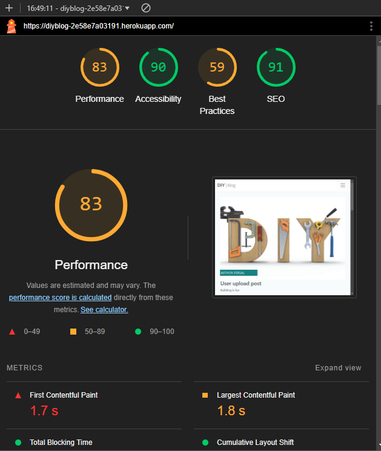

# TESTING

## Manual Testing

Testing was done throughout site development, for each feature before it was merged into the master file.

Usability was tested with the below user acceptance testing, sent to new users to ensure testing from different users, on different devices and browsers to ensure issues were caught and where possible fixed during development.

| **Feature**         | **Test Case**                                                                                       | **Steps to Perform**                                                                                                                                      | **Expected Outcome**                                                                                             | **Status** |
|----------------------|---------------------------------------------------------------------------------------------------|----------------------------------------------------------------------------------------------------------------------------------------------------------|------------------------------------------------------------------------------------------------------------------|------------|
| **User Registration** | Test new user registration.                                                                       | 1. Navigate to the registration page.<br>2. Fill in valid details (username, email, password).<br>3. Click "Register".                                   | User account is created, and a confirmation message is displayed.                                                | Passed     |
|                      | Attempt registration with invalid email format.                                                   | 1. Enter invalid email (e.g., `user@.com`).<br>2. Click "Register".                                                                                      | An error message is displayed indicating the email format is invalid.                                            | Passed     |
|                      | Attempt registration with an already registered email.                                            | 1. Enter an existing email address.<br>2. Click "Register".                                                                                              | An error message is displayed indicating the email is already in use.                                            | Passed     |
|                      | Test password strength validation.                                                                | 1. Enter a weak password (e.g., `123`).<br>2. Submit the form.                                                                                           | An error message is displayed prompting the user to use a stronger password.                                     | Passed     |
| **Login**            | Test login with valid credentials.                                                                | 1. Navigate to the login page.<br>2. Enter registered username/email and password.<br>3. Click "Login".                                                  | User is redirected to the dashboard/homepage.                                                                    | Passed     |
|                      | Test login with incorrect credentials.                                                            | 1. Enter wrong password for a valid user.<br>2. Click "Login".                                                                                           | An error message is displayed indicating incorrect login details.                                                | Passed     |
|                      | Check login persistence after refreshing the page.                                                | 1. Log in successfully.<br>2. Refresh the page.<br>3. Verify user remains logged in.                                                                     | User remains logged in, and session persists.                                                                    | Passed     |
|                      | Attempt login when the account is locked (if implemented).                                        | 1. Lock a test account (simulate multiple failed login attempts).<br>2. Attempt to log in.                                                               | An error message is displayed informing the user their account is locked.                                        | Passed     |
| **Post Management**  | Create a new blog post.                                                                           | 1. Log in.<br>2. Navigate to "Create Post".<br>3. Fill in title and content.<br>4. Click "Submit".                                                       | Post is created and displayed on the homepage.                                                                   | Passed     |
|                      | Edit an existing blog post.                                                                       | 1. Navigate to a created post.<br>2. Click "Edit".<br>3. Update the title/content.<br>4. Save changes.                                                   | Changes are saved and reflected on the post.                                                                     | Passed     |
|                      | Delete a blog post.                                                                               | 1. Navigate to a created post.<br>2. Click "Delete".                                                                                                     | Post is removed from the homepage and database.                                                                  | Passed     |
|                      | Verify draft saving functionality (if applicable).                                                | 1. Create a new post.<br>2. Save it as a draft.<br>3. Confirm it does not appear on the homepage but is accessible in the drafts section.                 | Draft is saved and accessible under the drafts section.                                                          | Passed     |
|                      | Test publishing a draft post.                                                                     | 1. Navigate to the drafts section.<br>2. Select a draft post.<br>3. Publish it.<br>4. Confirm it appears on the homepage.                                | Draft is published and visible on the homepage.                                                                  | Passed     |
| **Comment System**   | Add a comment to a blog post.                                                                     | 1. Navigate to a blog post.<br>2. Enter a comment in the provided form.<br>3. Submit the comment.                                                        | Comment appears under the blog post with the correct user attribution and timestamp.                              | Passed     |
|                      | Edit a comment.                                                                                   | 1. Locate a comment made by the logged-in user.<br>2. Click "Edit".<br>3. Modify the text.<br>4. Save changes.                                            | The edited comment is updated correctly.                                                                         | Passed     |
|                      | Delete a comment.                                                                                 | 1. Locate a comment made by the logged-in user.<br>2. Click "Delete".                                                                                    | The comment is removed from the post.                                                                            | Passed     |
|                      | Verify inappropriate content filtering in comments.                                               | 1. Enter a comment containing inappropriate words (if filtering is implemented).<br>2. Submit the comment.                                               | Comment is flagged or blocked, and a message is displayed to the user.                                           | Passed     |
| **Navigation**       | Test navigation between all pages.                                                                | 1. Use the navigation bar/menu to move between pages (e.g., Home, About, Contact).                                                                       | Each page loads as expected without errors.                                                                      | Passed     |
|                      | Test the functionality of the "Back to Top" button (if applicable).                               | 1. Scroll down the homepage.<br>2. Click the "Back to Top" button.                                                                                       | Page scrolls to the top smoothly.                                                                                | Passed     |
|                      | Test external links.                                                                              | 1. Click on external links provided in the footer or body content.<br>2. Verify the destination website opens in a new tab.                               | External websites open correctly in new tabs.                                                                    | Passed     |
| **Search (if any)**  | Search for a blog post by title.                                                                  | 1. Enter a blog post title in the search bar.<br>2. Press Enter or click the search button.                                                              | Relevant posts matching the title are displayed.                                                                 | Passed     |
|                      | Perform a search with no results.                                                                 | 1. Enter a random string in the search bar.<br>2. Press Enter.                                                                                           | A message is displayed indicating no results were found.                                                         | Passed     |
|                      | Verify search suggestion functionality (if implemented).                                          | 1. Begin typing a query in the search bar.<br>2. Observe any suggestions.                                                                                | Search suggestions appear based on existing content.                                                             | Passed     |
| **Responsiveness**   | Test website on desktop screens.                                                                  | 1. Open the site on a desktop device.<br>2. Resize the browser window to test layout flexibility.                                                        | Website adapts to full width without breaking layout.                                                            | Passed     |
|                      | Test website on mobile screens.                                                                   | 1. Open the site on a mobile device.<br>2. Interact with buttons, forms, and navigation.                                                                 | All elements are functional and responsive; layout fits the smaller screen.                                      | Passed     |
|                      | Verify touch gestures (if applicable).                                                            | 1. Swipe, pinch-to-zoom, and use other gestures on a mobile device.                                                                                      | Gestures work as expected, and the layout responds appropriately.                                                | Passed     |
| **Browser Testing**  | Test on Chrome.                                                                                   | 1. Open the site on Google Chrome.<br>2. Perform basic functionality tests (e.g., login, post creation).                                                 | All features function without issues.                                                                            | Passed     |
|                      | Test on Firefox.                                                                                  | 1. Open the site on Mozilla Firefox.<br>2. Perform basic functionality tests (e.g., navigation, commenting).                                             | All features function without issues.                                                                            | Passed     |
|                      | Test on Safari (Mac/iOS).         

---


---


## Bugs

**Solved bugs:**
1. I was getting an error message when I tried to test the JsonResponse response on Password change.

*Solution:*

Added `request.user` argument to the `PasswordChangeForm` form.

```python
    password_form = PasswordChangeForm(request.user, request.POST)
```

2. I was logged out right after the user logged in and the tests were showing the error `The view profiles.views.EditUserProfileView didn't return an HttpResponse object. It returned None instead.`

*Solution:*

Add additional import to the profiles views: `update_session_auth_hash`
And after saving the form, call the `update_session_auth_hash` function:

```python
    from django.contrib.auth import update_session_auth_hash

    if password_form.is_valid():
    password_form.save()
    update_session_auth_hash(request, password_form.user)
    return JsonResponse({'success': True})
```
3. I was struggling to get countries, county/regions, cities using various libraries. When planning the project I was aimed to use the `django-cities-light` library but this library is very heavy, and therefore, I wouldn't be able to deploy it to Heroku for free. Thus, I decided to use the [geonames](https://www.geonames.org/). The first issue that I encountered was that the link to the geonames website was not working. It was simply solved be enabling my account to use the geonames website. The following issue was regarding the selection regions and cities.

*Solution:*

Rather than searching for the regions by country name/code, I used country id to search for the regions.

```javascript
    let countryId = $('#id_country').find(':selected').data('id');
```

After retrieving the regions, I was able to get the first word of the region name and use it to search for the cities by link:

```javascript
    let stateName = $('#id_county_region').find(':selected').text();
    let stateNameFirstWord = stateName.split(' ')[0];
```

and url for AJAX request:

```javascript
    url: 'https://secure.geonames.org/searchJSON?q=' + stateNameFirstWord + '&username=<my_account_name>&style=FULL&fclName=city, village,...&maxRows=1000',
```

4. I was trying to get cover image for the product using related_name and if statements in the template. However, I was not able to get a single image, which is whether default and active, or not default but the first in the list of active images (``````).

*Solution:*

I added a method to the Product model that allows me to get the cover image.

```python
    def get_main_image(self):
        """Get main cover image of product"""
        images = ProductImage.objects.filter(product=self)
        if images.exists():
            active_images = images.filter(is_active=True)
            if active_images.exists():
                default_image = active_images.filter(default_image=True)
                if default_image.exists():
                    return default_image.first().image_url
                else:
                    return active_images.first().image_url
            return 'static/images/default_product_image.png' 
        else:
            return 'static/images/default_product_image.png' 
```

5. I realized that my .gitiignore file was not ignoring the db.sqlite3 file, however, it was stating the .gitiignore file 
```python
    *.sqlite3
    db.sqlite3
```

*Solution:*

At the very beginning, I used the following command:

```
git update-index --assume-unchanged db.sqlite3
```

But the output was: ```fatal: Unable to mark file db.sqlite3```

So, I user the following command for reset:

```
git reset HEAD
```
After that I run assume-unchanged again:

```
git update-index --assume-unchanged db.sqlite3
```

6. I was trying to create signals to create Stock when a ProductInventory is created.
However, I failed since I was using save method in the Stock model, which checks if there are any Product Inventory units available (if there 0 units, it will set ProductInventory.is_available to False). At first, I was trying to create a save method in the ProductInventory model to recreate signals, but I was not able to as it was calling "Unique constraint" error.

*Solution:*

I implemented checking functionality in views.py to prevent any errors:

```python
    product_inventory_active_stock = Stock.objects.filter(
                product_inventory=product_inventory_active
            )
            if product_inventory_active_stock:
                # do something
```

7. During the development of the bag functionality, I have noticed that js code was sending not the correct id data.

*Solution:*

I created product_inventory_id variable outside of the functions and reassigned it to the id of the ProductInventory object, which was checked in on change event.

```javascript
  let product_inventory_id = 0
    $('.product__options').on('change', 'input', function() {
      let attribute_value = $(this).val();
      let attribute_name = $(this).get(0).name;
      let availableAttrsFromOtherGroups = [];
      for (let stockOption of values_list_array) {
        if (stockOption[attribute_name] == attribute_value && stockOption["Quantity"] > 0) {
          for(let key in stockOption) {
            if (key != "Quantity" && key != attribute_name) {
              if (key == "id") {
                product_inventory_id = stockOption[key];
              }
              availableAttrsFromOtherGroups.push(stockOption[key]);
            }
          }
        }
      }
    });
```

8. When I was trying to implement sending email on successful payment with url link functionality, I was receiving only content_html in the email without the content_text.


  *Solution:* Move the email content into email content template.


```python
from django.core.mail import EmailMultiAlternatives


def payment_confirmation(data):
    Order.objects.filter(order_key=data).update(billing_status=True)
    # send email to the customer
    order = Order.objects.get(order_key=data)
    # get this order
    order_id = order.id   
    order_obj = Order.objects.get(id=order_id)
    customer = order_obj.user
    subject = 'Payment Confirmation'
    # get the order total paid
    order_total_paid = order_obj.total_paid
    order_num = str(order_obj.order_number)
    link = (
        'https://wowder.herokuapp.com/orders/' + str(customer.username) +
        '/my_orders/' + order_num + '/'
    )
    subject, from_email, to = (
        'Payment Confirmation', 'wow@der.com', str(customer.email)
    )
    text_content = ''
    html_content = '<h1>Payment Confirmation</h2>' \
                '<p>Your payment of ' + str(order_total_paid) \
                + ' has been confirmed.</p>' \
                '<p>You can view your order details by ' \
                'clicking on your your order information link below:</p>' \
                '<strong>Order ID: </strong>' \
                '<a href=' + link + '>' + order_num + \
                '</a><br><p>Thank you for shopping with us!</p>' \
                '<em>WoWder shop</em>'
    msg = EmailMultiAlternatives(subject, text_content, from_email, [to])
    msg.attach_alternative(html_content, "text/html")
    msg.send(fail_silently=False)

```

9. After adding values for men and women sizing, I got an error of returning more than 1 object on get method. I t was due to the same values for sizing, like L size for men clothing and L size for women clothing

*Solution:* Change get method on filter and adding for loop to go through all received objects:

```python
    attribute_testing_set_list = list(attribute_testing_set)
    selected_value = ProductAttributeValue.objects.filter(
        attribute_value=value.attributevalues
    )
    for s_v in selected_value:
        for attribute in attribute_testing_set_list:
            # Check if the attribute is in the attr set list
            if str(attribute) == str(
                s_v.product_attribute
            ):
                product_inventory_active_values[
                    attribute
                ] = s_v.attribute_value
```

10. The following issue was opened by another GitHub user:


*Solution:*

[Link to the issue and solution](https://github.com/IuliiaKonovalova/e-commerce/issues/335)

11. When the admin needed to add a new product type to the store, it wasn't impossible to add a new product type without any attributes. However, it was possible through the admin panel.

*Solution:*

Add __init__ method to the ProductType model and add the following code:

```python
    def __init__(self, *args, **kwargs):
        super().__init__(*args, **kwargs)
        self.fields['product_type_attributes'].required = False
```


**Unsolved bugs:**

1. When I was using attributes for the `id=""` and `for=""` attributes for the inputs, I was getting html errors regarding spaces between words. 

*Temporary Solution:*

I was temporary able to resolve this issue by adding `-` rather than ` ` in the DB manually. The decision to take use this shortcut was made because of the lack of time and the js logic and python logic were implemented earlier.


*Future Solution:*

Replace the ` ` with `-` in ProductDetail View `.replace(" ", "-")`, then adjust javascript logic for the selected elements, then `.replace("-", " ")` in the AddToBagAJAXView, PromoCodeAJAXView, AddRemoveProductWishlistAJAXView, EmailStockNotificationFormAJAX and test the functionality.


2. The error appeared in console when payment was processing once during the final testing. I've tried many times to reproduce it, but haven't been able to. Include any links you found that show it might be random from stripe, and that it's out of your control at this time, but will keep an eye on it for potential future issues


*Explanation:*

It might be coming from stripe itself because and I'm not able to fix it. Here is the link to the issue from github and the information provided.

[react-stripe-elements. Uncaught (in promise) undefined #408](https://github.com/stripe-archive/react-stripe-elements/issues/408)

---

## Validation

### HTML Validation:
- No errors or warnings were found when passing through the official [W3C](https://validator.w3.org/) validator.


### CSS Validation:

- No errors or warnings were found when passing through the official [W3C (Jigsaw)](https://jigsaw.w3.org/css-validator/#validate_by_uri)


### JS Validation:

- No errors or warning messages were found when passing through the official [JSHint](https://www.jshint.com/) validator.

### Python Validation:

- No errors were found when the code was passed through Valentin Bryukhanov's [online validation tool](http://pep8online.com/). According to the reports, the code is [Pep 8-compliant](https://legacy.python.org/dev/peps/pep-0008/). This checking was done manually by copying python code and pasting it into the validator.

- [Bag. Validation Report](documentation/validation/pep8_validation_bag.pdf)

- [Email_notifications. Validation Report](documentation/validation/pep8_validation_email_notifications.pdf)

- [Home. Validation Report](documentation/validation/pep8_validation_home.pdf)

- [Inventory. Validation Report](documentation/validation/pep8_validation_inventory.pdf)

- [Orders. Validation Report](documentation/validation/pep8_validation_orders.pdf)

- [Payment. Validation Report](documentation/validation/pep8_validation_payment.pdf)

- [Personnel. Validation Report](documentation/validation/pep8_validation_personnel.pdf)

- [Profiles. Validation Report](documentation/validation/pep8_validation_profiles.pdf)

- [Promotions. Validation Report](documentation/validation/pep8_validation_promotions.pdf)

- [Reviews. Validation Report](documentation/validation/pep8_validation_reviews.pdf)

- [Wishlist. Validation report](documentation/validation/pep8_validation_wishlist.pdf)


---
## Lighthouse Report

LightHouse is a web performance testing tool that can be used to evaluate the performance of a website. The report is generated by Google Chrome.





---

## Compatibility

Testing was conducted on the following browsers;

- Brave;
- Chrome;
- Firefox;

[Compatibility Report](documentation/validation/compatibility.pdf)

---
## Responsiveness

The responsiveness was checked manually by using devtools (Chrome) throughout the whole development. It was also checked with [Responsive Viewer](https://chrome.google.com/webstore/detail/responsive-viewer/inmopeiepgfljkpkidclfgbgbmfcennb/related?hl=en) Chrome extension.

[Responsiveness Report](documentation/testing/responsiveness.pdf)
